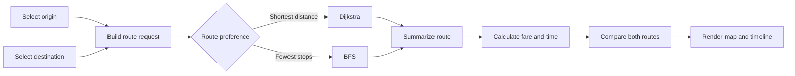
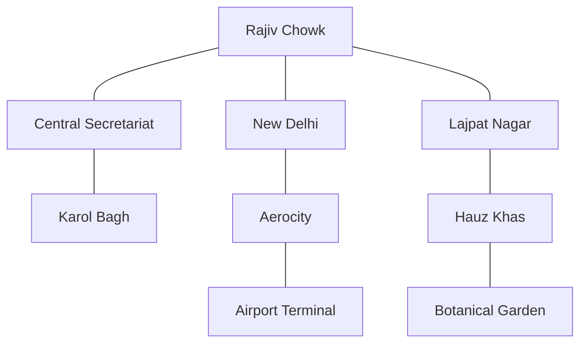

# Metro Saarthi

> A graph-powered metro route planner for faster, clearer journeys.

Metro Saarthi is a client-side React application for exploring a Delhi NCR-inspired metro network. Select two stations, choose what matters most for your journey, and compare routes with practical details such as distance, stops, interchanges, estimated time, and fare.

## Product Snapshot

| Area | Current implementation |
| --- | --- |
| Network | 22 stations across 4 metro lines |
| Route modes | Shortest distance and minimum stops |
| Algorithms | Dijkstra's algorithm and breadth-first search |
| Output | Map highlight, route comparison, timeline, and estimates |
| Architecture | Client-side React app with no backend or external API |

## Core Experience

- Search and select a **From** and **To** station
- Swap stations in one action
- Choose between **Shortest route** and **Fewest stops**
- View both route options side by side
- Inspect the active route on the network map
- Follow the station-by-station journey timeline
- Review distance, time, stops, interchanges, and estimated fare

## Route Planning Flow



## Graph Model

Stations are graph nodes. Metro connections are bidirectional weighted edges containing distance, travel time, and line information.



The planner computes both route variants for every valid request, then derives the user-facing summary from the selected path.

## Algorithms

| Strategy | Algorithm | Optimizes for | Best suited to |
| --- | --- | --- | --- |
| Shortest distance | Dijkstra | Total edge distance | A shorter physical journey |
| Fewest stops | BFS | Number of edges | Fewer station stops |

### Journey estimates

Route summaries include:

- total distance and number of stations
- estimated travel time
- interchange count
- estimated fare in Indian rupees
- station-by-station timeline

Journey time includes a 30-second dwell estimate per stop and 5 minutes per interchange, as implemented in the route utilities.

## Technology

- **React** for the interface and component architecture
- **Vite** for development and production builds
- **JavaScript** for graph, fare, and journey calculations
- **Lucide React** for interface icons
- **Custom CSS** with the Tailwind CSS Vite plugin available in the toolchain

## Getting Started

### Requirements

- Node.js 18 or newer
- npm 9 or newer

### Install and run

```bash
git clone https://github.com/Mahi1729/Metro-Saarthi.git
cd Metro-Saarthi
npm install
npm run dev
```

Open the local URL printed by Vite, usually `http://localhost:5173`.

### Build for production

```bash
npm run build
npm run preview
```

## Project Structure

```text
src/
|-- algorithms/       BFS and Dijkstra implementations
|-- assets/           Visual and static assets
|-- components/       Map, picker, navigation, and route UI
|-- data/             Stations, lines, and graph connections
|-- hooks/            Route-planning state and orchestration
|-- utils/            Fare, journey-time, and route helpers
|-- App.jsx           Main application layout
`-- style.css         Visual system and responsive styling
```

## Available Scripts

| Command | Purpose |
| --- | --- |
| `npm run dev` | Start the Vite development server |
| `npm run build` | Create an optimized production build |
| `npm run preview` | Preview the production build locally |

## Scope and Data

Metro Saarthi currently uses a self-contained demonstration dataset in `src/data/metroData.js`. It does not use live transit data, external station APIs, authentication, or a backend service. The network can be expanded by adding stations and connections to the data model.

## License

This project currently has no declared open-source license.